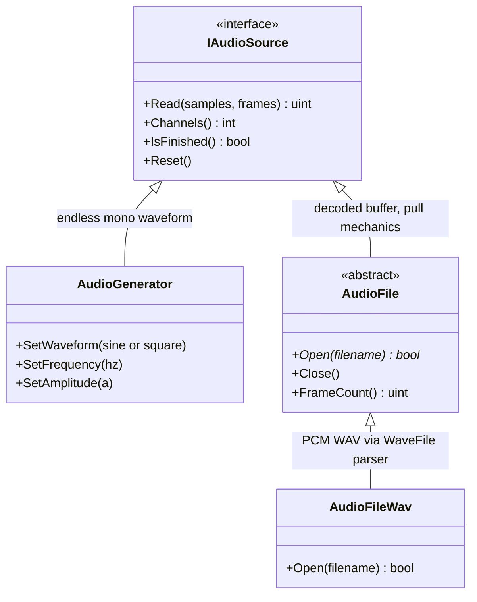
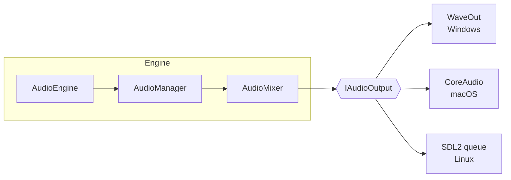
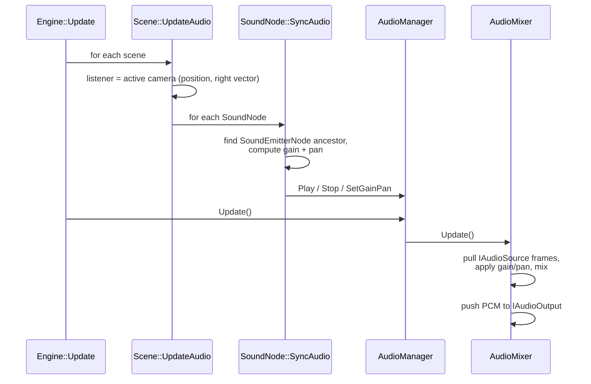

# FORG

FORG is a C++20 rendering-API abstraction library. It defines a common set of rendering interfaces (`IRenderDevice`, `IRenderer`, `ITexture`, `IVertexBuffer`, …) and provides multiple backends behind them — a reference software renderer built into the library, a native Apple Metal backend (macOS), plus OpenGL, software, OpenCL, and C++ AMP renderer plugins. It originated from the old `forg.googlecode.com` project.

## Supported platforms

- **macOS** — primary CMake target
- **Windows** — CMake/MSVC build with OpenGL and software renderer plugins plus the Win32 sample app
- **Linux** — CMake build with SDL2 windowing and the software renderer plugin plus the SDL sample app
- iOS platform macros exist (`FORG_PLATFORM_IOS`) but there is no app target yet

Any other platform fails CMake configuration with a fatal error.

## Building

Requires CMake >= 3.21, Ninja, and a C++20 compiler. Linux builds also require SDL2 and FreeType development headers/libraries, for example `libsdl2-dev libfreetype-dev` on Debian/Ubuntu or `SDL2-devel freetype-devel` on Fedora. `CMakePresets.json` defines `debug` and `release` presets with output in `build/debug` and `build/release`:

```sh
cmake --preset release
cmake --build --preset release
```

(Use `--preset debug` for a debug build. The software renderer is ~4× faster in release.)

The CMake build produces these main targets:

- **`forg`** — the static library (`src/forg/`)
- **`swrenderer`** (macOS) — the software-renderer plugin, built as `libswrenderer.dylib`
- **`metalrenderer`** (macOS) — the native Apple Metal backend, built as `libmetalrenderer.dylib`; the default `config.yml` driver
- **`macapp`** (macOS) — the Cocoa sample app (`src/macapp/`): reads `config.yml` for window geometry, control-server settings, and the renderer driver, loads the plugin with `dlopen`, and renders the demo scene
- **`linuxapp`** (Linux) — the SDL2 sample app (`src/linuxapp/`): reads `config.yml`, loads `libswrenderer.so`, and renders the same demo scene through the software renderer
- **`forg_tests`** — Catch2-based unit tests, built when CMake testing is enabled

Run the macOS sample with:

```sh
./build/release/src/macapp/macapp
```

A post-build step copies `libswrenderer.dylib`, `libmetalrenderer.dylib`,
`src/macapp/config.yml`, and the shared `data/` assets, including
`data/scene.yml`, next to the binary. `config.yml` selects which plugin
`macapp` loads (default: `libmetalrenderer.dylib`; switch to
`libswrenderer.dylib` to compare).

On Linux, build and run the SDL sample with:

```sh
cmake --preset debug -DBUILD_TESTING=OFF
cmake --build --preset debug --target linuxapp
./build/debug/src/linuxapp/linuxapp
```

A post-build step copies `libswrenderer.so`, `src/linuxapp/config.yml`,
and the shared `data/` assets, including `data/scene.yml`, next to the binary.
The Linux v1 path intentionally uses SDL2 plus the software renderer only;
Metal remains macOS-only, and the OpenGL plugin is still Windows/WGL-oriented.

If `controlserver.enabled` is `true` in `config.yml`, the sample starts a
local HTTP control endpoint. It accepts scene/camera commands plus normalized
input events such as `/input/drag?button=left&dx=12&dy=-4` for orbit,
`/input/drag?button=right&dx=12&dy=-4` for truck, and
`/input/scroll?delta=1` for zoom. Native macOS and Win32 mouse handling uses
the same `forg::InputEvent` path through `Engine::HandleInput`.

Notes:

- CMake uses the host default macOS architecture. Pass `-DCMAKE_OSX_ARCHITECTURES=x86_64` or `-DCMAKE_OSX_ARCHITECTURES=arm64` at configure time when you need a specific architecture.
- The options `FORG_USE_OPENCL` and `FORG_USE_ZLIB` default to `OFF`.
  `FORG_USE_FREETYPE` defaults to `ON`, uses system FreeType when available
  and falls back to a fetched copy, and enables `forg::Font` text overlays in
  the sample apps. Disable it with `-DFORG_USE_FREETYPE=OFF` for a minimal
  dependency build. Enabling `FORG_USE_ZLIB`
  enables compressed DirectX `.x` mesh support using CMake's zlib package or a
  fetched fallback. The header-only `cgltf` parser in `extern/cgltf/` is always
  wired in (`extern/CMakeLists.txt`) and linked into `forg` for glTF mesh
  loading.
- Source files for the `forg` library are listed explicitly in `src/forg/Sources.cmake` — new files must be added there.

## Using FORG from CMake

The package target is **`Forg::forg`** and public headers are included as
`<forg/...>`.

Build-tree consumers can add this repository directly:

```cmake
add_subdirectory(path/to/forg)
target_link_libraries(my_app PRIVATE Forg::forg)
```

Installed consumers should point CMake at the install prefix:

```sh
cmake --install build/release --prefix /path/to/forg-sdk
cmake -S . -B build -DCMAKE_PREFIX_PATH=/path/to/forg-sdk
```

Then consume the exported package:

```cmake
find_package(Forg 1.0 CONFIG REQUIRED)
target_link_libraries(my_app PRIVATE Forg::forg)
```

The install tree contains the static library, public headers under
`include/forg`, and package files under `lib/cmake/Forg`. Private source
directories are not part of the SDK surface.

Supported compiler configurations are AppleClang through the macOS presets and
MSVC 2022 through the Windows presets. `FORG_WARNINGS_AS_ERRORS`,
`FORG_ENABLE_CLANG_TIDY`, and `FORG_ENABLE_PCH` control local quality checks.
`FORG_USE_OPENCL`, `FORG_USE_FREETYPE`, and `FORG_USE_ZLIB` are project feature
switches; FreeType defaults to `ON`, while OpenCL and zlib default to `OFF`. On Windows, `Forg::forg` publishes the
`FORG_STATIC`, `NOMINMAX`, and `WIN32_LEAN_AND_MEAN` definitions required by
consumers of the static library.

## Testing

The CMake build uses CTest with Catch2 v3. Catch2 is fetched with CMake `FetchContent` and pinned in `tests/CMakeLists.txt`, so the first configure of a fresh build directory needs network access.

Run the test suite with:

```sh
cmake --preset debug
cmake --build --preset debug
ctest --preset debug
```

Release tests use the matching preset and build directory:

```sh
cmake --preset release
cmake --build --preset release
ctest --preset release
```

For local memory and undefined-behavior checks, use the sanitizer preset:

```sh
cmake --preset debug-asan
cmake --build --preset debug-asan
ctest --preset debug-asan
```

Testing is controlled by CMake's standard `BUILD_TESTING` option. To configure without tests:

```sh
cmake --preset release -DBUILD_TESTING=OFF
```

Coverage lives under `tests/` and focuses on deterministic library behavior:
math/value types, ownership helpers, XML/YAML parsing, mesh factories and glTF
loading, command parsing/queues, package consumption, renderer plugin ABI
compatibility, and a headless reference-renderer triangle checksum. Cocoa
windowing and OpenCL remain outside the automated test surface.

### Windows build

Use the `windows-debug` and `windows-release` presets with Visual Studio 2022. CMake builds `forg`, the direct Win32 `winapp`, `glrenderer`, the Windows software renderer, and the test suite. OpenCL and C++ AMP remain unsupported legacy targets until they are independently revived or removed.

A post-build step copies `glrenderer.dll`, `swrenderer.dll`,
`src/winapp/config.yml`, and the shared `data/` assets, including
`data/scene.yml`, next to `winapp.exe`. `config.yml` selects which plugin
`winapp` loads and controls the initial window geometry.

## Project layout

```text
src/forg/include/forg/   Public headers and root APIs such as Engine.h/Input.h,
                         plus one directory per module:
                         math, rendering, audio, core, fs, os, script,
                         image, mesh, nn, ui, cpu, opencl, debug
src/forg/src/            Private implementation, mirroring the module layout;
                         OS-specific code under os/{win32,osx,linux}/
src/macapp/              Cocoa sample app (CMake)
src/linuxapp/            SDL2 Linux sample app (CMake)
src/winapp/              Direct Win32 sample app (CMake)
src/swrenderer/          Software-renderer plugin (CMake dylib on macOS,
                         CMake DLL on Windows, shared object on Linux)
src/metalrenderer/       Native Apple Metal renderer plugin (CMake dylib, macOS)
src/glrenderer/          OpenGL renderer plugin (CMake DLL on Windows)
src/{cl,amp}renderer/    Unsupported legacy renderer sources
data/                    Shared sample assets, UI YAML, textures, and fonts
tests/                   Catch2/CTest unit tests for the forg library
docs/nn/README.md        Notes and examples for the tiny neural-network module
extern/                  Vendored dependencies: cgltf (glTF 2.0 parser, wired
                         into CMake and linked into forg); OpenCL/OpenGL
                         headers
tools/                   Repository tooling, including clang-format
```

The umbrella headers are `forg/forg.h` and `forg/rendering.h`. Note that some `.cpp` files live alongside their headers in the `include/` tree — it is not header-only.

## Architecture

The rendering abstraction lives in `include/forg/rendering/`. Backends implement the `IRenderDevice` family of interfaces:

- **Reference software renderer** — compiled into the library itself (`include/forg/rendering/reference/`)
- **Software renderer plugin** (`src/swrenderer/`) — wraps the reference renderer with a platform presentation layer (CoreGraphics/CALayer on macOS, GDI on Windows); loaded at runtime via `dlopen`/`LoadLibrary` from the driver named in the sample app config
- **Metal renderer plugin** (`src/metalrenderer/`) — native Apple Metal backend hosting a `CAMetalLayer` in the sample's `NSView`; macOS only, the default `config.yml` driver
- **OpenGL renderer plugin** (`src/glrenderer/`) — loaded at runtime on Windows via `LoadLibrary`
- **OpenCL / C++ AMP renderers** — unsupported legacy sources, not part of the canonical CMake build

Canonical renderer plugins expose a versioned descriptor. The current
descriptor includes a display name plus a plugin-local destroy callback so hosts
can show the active renderer and do not delete plugin-owned renderer objects
across module or CRT boundaries. The loaders still accept version-1 descriptors
and legacy `forgCreateRenderer`-only plugins for 1.x compatibility.

Beyond rendering, the library includes math types, an audio engine (see [Audio](#audio)), XML and YAML parsers (`script`), image loading, mesh loading (DirectX `.x`, `.ply`, and glTF 2.0 `.gltf`/`.glb` static meshes via `Mesh::FromFile`), a UI layer, filesystem and OS abstractions.

`Engine` owns the active camera and handles normalized input events from
`forg/Input.h`; sample apps only translate native events before calling
`Engine::HandleInput`.

## Audio

The audio module (`include/forg/audio/`) plays sounds defined in a scene
through a fixed pipeline: sources produce PCM, the mixer combines them, and a
platform output plays the result. Everything runs at the mixer's fixed format —
**44100 Hz, 16-bit signed PCM, stereo out** — with up to
`AudioMixer::MAX_STREAMS` (10) simultaneous voices.



`IAudioSource` is a pull interface: the mixer asks each attached source for
frames during `Update()`. `AudioGenerator` synthesizes sine/square waves and
never finishes; `AudioFile` owns the decoded-sample buffer and position so a
future codec (e.g. `AudioFileOgg`) only needs to implement `Open()`.
`AudioFileWav` accepts PCM WAV files at 44100 Hz, mono or stereo, 8 or 16 bits
(8-bit data is widened to 16), and rejects anything else — there is no
resampling.

Ownership stack and platform outputs:



`AudioManager` allocates mixer streams as *voices*:
`Play(source, looping, gain, pan)` returns a voice handle (`INVALID_VOICE`
when all 10 are busy), `Stop`/`StopAll` release voices, and `Update()`
reclaims voices whose one-shot sources have finished. Sources are passed as
`std::shared_ptr<IAudioSource>` so the manager and mixer keep them alive while
their voices are attached.

### Scene sound nodes

Two scene node types (`include/forg/scene/`) drive audio from scene content:

- **`SoundNode`** selects and owns an audio source — a generator
  (`SetGenerator`) or a WAV file (`SetFile`, opened later by
  `Scene::LoadResources`) — with `looping`, `autoplay`, and `gain`
  parameters and `Play()`/`Stop()` requests.
- **`SoundEmitterNode`** carries a 3D position and reference distance. A
  `SoundNode` looks for the nearest emitter among its ancestors; the emitter's
  distance to the listener drives attenuation
  (`ref_distance / max(distance, ref_distance)`) and left/right panning. The
  listener is the scene's active camera. A `SoundNode` without an emitter
  ancestor plays flat (2D), so UI/music scenes need no emitter.

Per-frame flow inside `Engine::Update`:



Both node types serialize with the scene. A YAML scene with a positional
looping tone and a one-shot WAV clip:

```yaml
scene:
  version: 1
  nodes:
    - node:
        type: SoundEmitterNode
        parent: -1
        emitter: { position_x: 5.0, position_y: 0.0, position_z: 0.0,
                   ref_distance: 2.0 }
    - node:
        type: SoundNode
        parent: 0            # child of the emitter -> positional
        sound: { source: generator, waveform: sine, frequency: 440.0,
                 amplitude: 0.5, looping: 1, autoplay: 1, gain: 1.0 }
    - node:
        type: SoundNode
        parent: -1           # no emitter ancestor -> plays flat
        sound: { source: file, file: "data:sounds/step.wav" }
```

Known limitation: `AudioMixer::Update` pushes up to one second of audio per
call, so gain/pan updates (including moving emitters) can lag by up to that
much.

## CI

GitHub Actions runs canonical debug and release CMake workflows on macOS and Windows, plus debug and release Linux builds for the SDL2 software-renderer sample app.

## License

Licensed under the GNU LGPL v3 — see [COPYING.LESSER](COPYING.LESSER) and [COPYING](COPYING).
