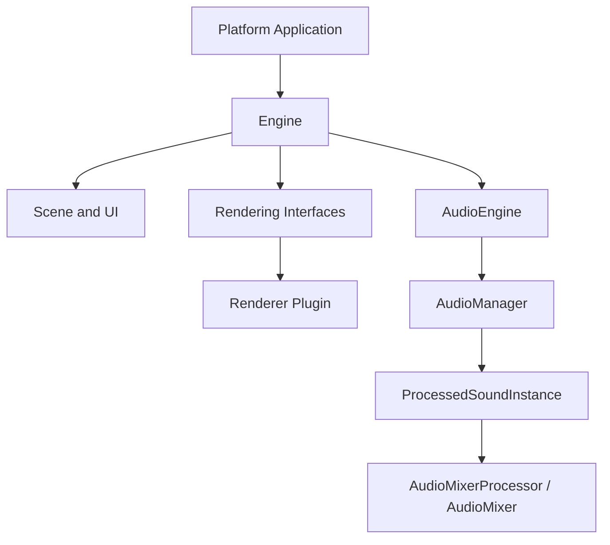

# FORG Architecture

FORG is organized around a platform-independent engine and library with
replaceable rendering backends and a processor-driven audio runtime. Public
interfaces live under `src/forg/include/forg/`; implementations live under
`src/forg/src/` or in separately loaded renderer plugins.

## Subsystem Documents

- [Rendering Architecture](rendering_architecture.md) describes rendering
  interfaces, plugin boundaries, backend selection, and object ownership across
  module boundaries.
- [Audio Architecture](audio_architecture.md) describes sound instances,
  processor chains, mixer routing, source ownership, IDs, and lifecycle flow.
- [Neural Network Module](nn/README.md) describes the small neural-network
  subsystem, its layers, training utilities, examples, and current limitations.

Other modules, including scene management, serialization, filesystem access,
image loading, mesh loading, UI, and control commands, currently rely on their
public headers and the main README. Add a subsystem architecture document here
when one of those modules develops contracts or ownership rules that need a
stable design reference.

[Back to the main README](../README.md)
