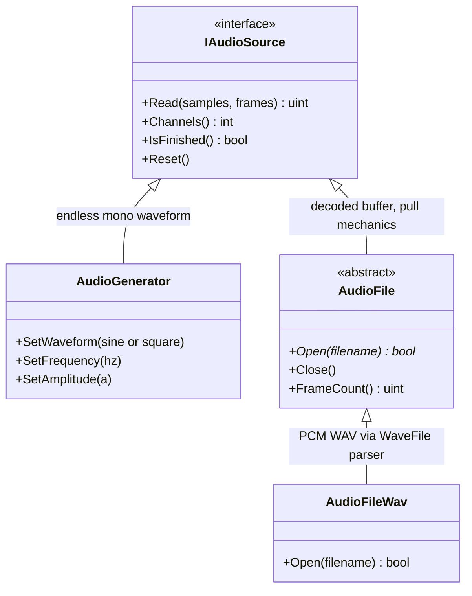
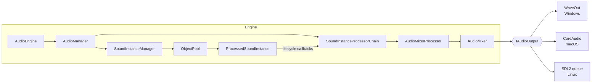
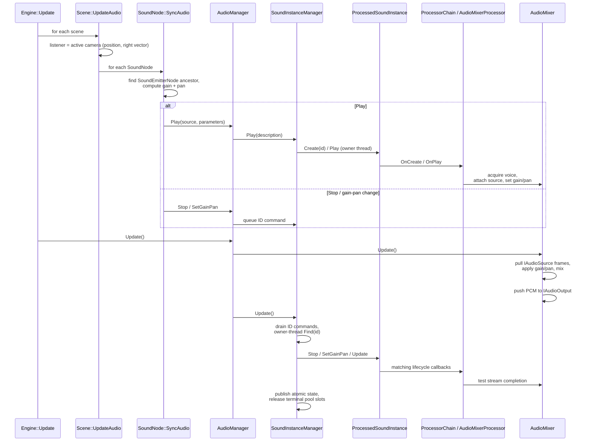

# Audio Architecture

The audio module uses a pull-based PCM pipeline. Sources produce samples,
`AudioMixer` combines active streams, and a platform `IAudioOutput` sends the
result to the operating system. The mixer uses a fixed format of 44100 Hz,
16-bit signed PCM with stereo output and supports up to
`AudioMixer::MAX_STREAMS` (10) simultaneous voices.

## Source Model

`IAudioSource` is a pull interface: the mixer asks each attached source for
frames during `Update()`. `AudioGenerator` synthesizes sine or square waves and
never finishes. `AudioFile` owns its decoded samples and read position so
additional codecs only need to implement `Open()`.

`AudioFileWav` accepts PCM WAV files at 44100 Hz, mono or stereo, with 8-bit or
16-bit samples. It widens 8-bit data to 16 bits and rejects unsupported formats;
the audio pipeline does not resample.

## Ownership And Processing

`AudioManager` owns one `SoundInstanceProcessorChain`, currently containing an
`AudioMixerProcessor`, and one `SoundInstanceManager`. The instance manager
owns the chain reference, fixed-capacity instance pool, active-instance
registry, command queue, and public state snapshots. `AudioManager` passes
descriptions and IDs only; it never receives or retains a
`ProcessedSoundInstance*`.

Every successful `Play(source, looping, gain, pan)` builds a
`SoundInstanceDescription` and delegates creation and playback to
`SoundInstanceManager`. `ProcessedSoundInstance::Create()` establishes the ID
and active processor-context count, then invokes `OnCreate` in chain order.
`AudioMixerProcessor::OnCreate` reads the source and looping flag from the
description and constructs its state in its own context. `OnPlay` acquires the
mixer voice and attaches the configured source.

The instance manager stores and updates sound instances rather than mixer
voices. Calls are routed by the monotonic `SoundInstanceId` returned from
`Play()`. `INVALID_SOUND_INSTANCE_ID` indicates failure. Instance IDs are
independent of pool-slot and backend-voice reuse.

`AudioMixerProcessor` stores its `IAudioSource`, looping state, and acquired
mixer voice ID in the instance's processor-specific `SoundProcessorContext`.
The voice ID is a backend detail and is never used by `AudioManager` as sound
identity. The processor attaches the source, applies gain and pan, detects
completed one-shots, and releases the voice during stop or destruction. The
context and mixer retain the shared source while playback is active.

## Lifecycle

`ProcessedSoundInstance` orchestrates create, play, update, pause, resume,
volume, stop, and destroy callbacks in processor-chain order. Each processor has
isolated context storage for its per-sound state. Shared values such as volume,
pan, listener vectors, and spatialization flags live in
`SoundProcessingParameters`.

Processor results control traversal and instance state:

- `Continue` advances to the next processor.
- `Bypass` excludes that processor from later callbacks except destruction.
- `Wait` records the phase and processor index so a later update resumes there.
- `Stop`, `Fail`, and `Complete` enter the corresponding terminal state and run
  processor destruction cleanup.

The direct `ProcessedSoundInstance` request methods can queue stop, pause,
resume, and volume operations from other threads. The instance drains those
commands in FIFO order at the beginning of its normal update. Normal
`AudioManager` control uses the manager-level ID queue described below instead
of exposing an instance.

## Bounded Allocation

`AudioManager` constructs `SoundInstanceManager` with
`AudioMixer::MAX_STREAMS` slots. The pool performs its backing allocation when
the manager is constructed; creating, updating, and reclaiming instances does
not allocate afterwards. Each pool slot contains the complete
`ProcessedSoundInstance` state rather than a pimpl pointer.

The sound-instance hot path uses these compile-time bounds:

- A processor chain contains at most 16 processors.
- Every instance contains 16 inline `SoundProcessorContext` objects.
- Each context provides 64 bytes of aligned inline typed state and a fixed
  128-byte message buffer. A processor state that exceeds the typed-storage
  limit fails at compile time.
- Each instance has a 16-entry inline lifecycle-command queue.
- `SoundInstanceManager` has a 64-entry inline ID-command queue.

The active-instance registry and atomic snapshot table reserve their complete
capacity during manager construction. Audio sources, processor objects, and
custom code invoked by processors are outside this allocation guarantee and
may manage their own memory.

## Threading Contract

`ObjectPool` and the active-instance registry are owner-thread data. `Play`,
`Update`, `Clear`, processor-chain mutation, and shutdown must run on the audio
owner thread. Raw instance pointers never cross the `SoundInstanceManager`
boundary; its private `Create` and `Find` helpers are called only by that
thread.

`Stop`, `StopAll`, and `SetGainPan` do not look up an instance. They append an
ID-based command to the manager's fixed queue under a short mutex. All three
return `false` if the queue is full; `Stop` and `SetGainPan` also reject
`INVALID_SOUND_INSTANCE_ID`. The owner thread drains the queue during
`SoundInstanceManager::Update`, resolves IDs, invokes lifecycle operations,
publishes the resulting state, and finally releases terminal pool slots. A
nonzero ID that no longer identifies an active instance is accepted into the
queue and ignored when it is resolved.

`StopAll` captures the most recently issued instance ID when it is queued and
only stops instances at or below that ID. This preserves request ordering when
new sounds are played before the owner thread drains the queue: a stale
`StopAll` request cannot stop a later instance.

`IsPlaying` never dereferences a pooled object. It reads a fixed table of
atomic `(ID, state)` snapshots and verifies the ID both before and after the
state load so slot reuse cannot make a stale ID appear active. A queued stop
therefore remains visible as playing until the next update processes it.

`AudioManager::Shutdown` is an owner-thread teardown operation. It clears
queued commands, stops all active instances immediately, invalidates their
snapshots, and then releases the pool objects before shutting down the mixer.
Because callers hold IDs instead of object references, shutdown cannot leave
an external dangling instance pointer.

## Per-Frame Flow

`AudioMixer::Update()` currently pushes up to one second of audio per call, so
gain and pan changes, including moving emitters, can lag by up to that amount.
Manager commands are processed after that mixer update and therefore take
effect during the instance-manager portion of the frame.

[Back to the architecture index](ARCHITECTURE.md)
