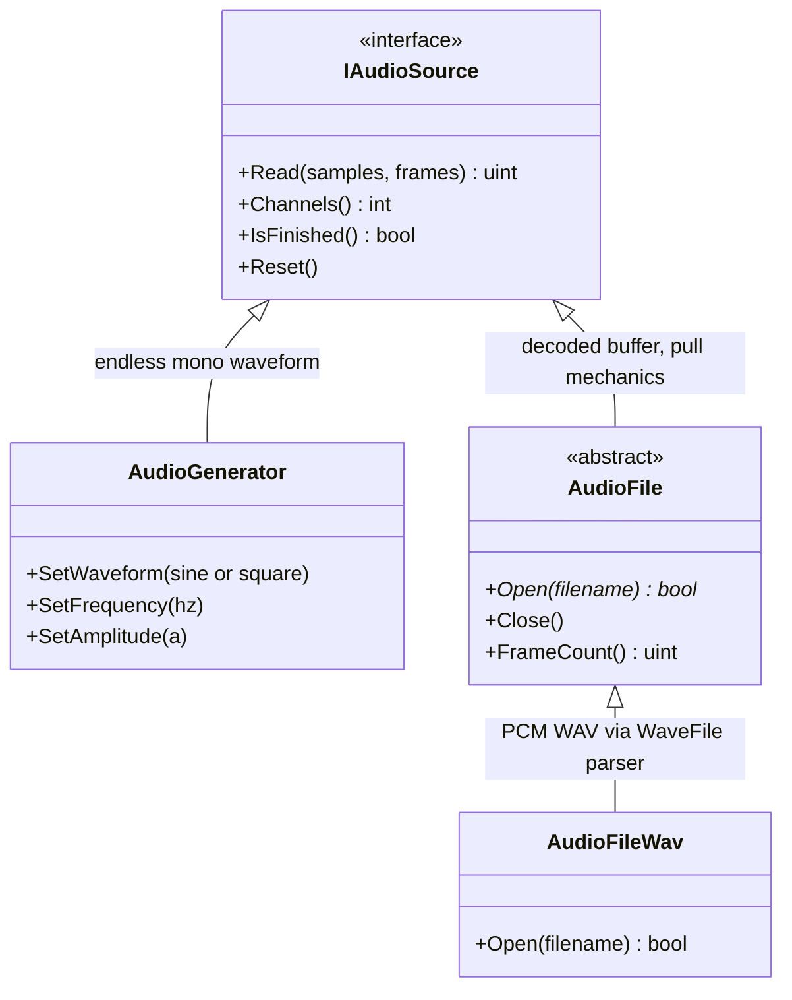
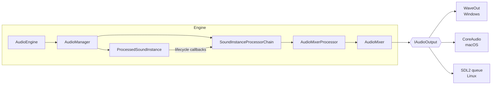
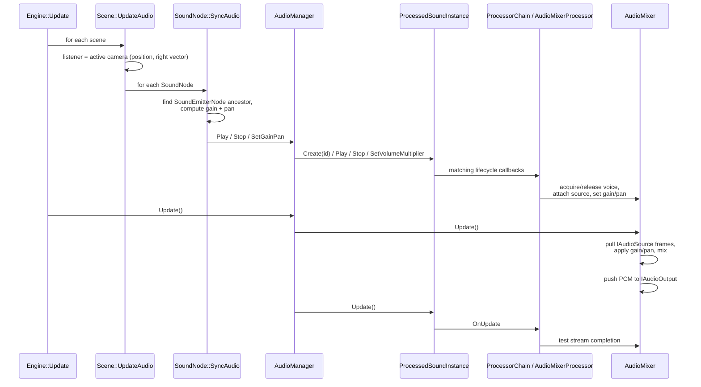

# Audio Architecture

The audio module uses a pull-based PCM pipeline. Sources produce samples,
`AudioMixer` combines active streams, and a platform `IAudioOutput` sends the
result to the operating system. The mixer uses a fixed format of 44100 Hz,
16-bit signed PCM with stereo output and supports up to
`AudioMixer::MAX_STREAMS` (10) simultaneous voices.

## Source Model

`IAudioSource` is a pull interface: the mixer asks each attached source for
frames during `Update()`. `AudioGenerator` synthesizes sine or square waves and
never finishes. `AudioFile` owns its decoded samples and read position so
additional codecs only need to implement `Open()`.

`AudioFileWav` accepts PCM WAV files at 44100 Hz, mono or stereo, with 8-bit or
16-bit samples. It widens 8-bit data to 16 bits and rejects unsupported formats;
the audio pipeline does not resample.

## Ownership And Processing

`AudioManager` owns one `SoundInstanceProcessorChain`, currently containing an
`AudioMixerProcessor`. Every successful `Play(source, looping, gain, pan)`
creates a `ProcessedSoundInstance`, explicitly creates its processor contexts,
and runs its play lifecycle. The instance constructor only retains the shared
chain; lifecycle initialization happens in `Create()` so instances can later be
allocated from a pool without making construction expensive.

The manager stores and updates sound instances rather than mixer voices. It
routes `Stop`, `IsPlaying`, and `SetGainPan` by the monotonic `SoundInstanceId`
returned from `Play()`. `INVALID_SOUND_INSTANCE_ID` indicates failure. Instance
IDs are independent of backend voice reuse.

`AudioMixerProcessor` stores its `IAudioSource`, looping state, and acquired
mixer voice ID in the instance's processor-specific `SoundProcessorContext`.
The voice ID is a backend detail and is never used by `AudioManager` as sound
identity. The processor attaches the source, applies gain and pan, detects
completed one-shots, and releases the voice during stop or destruction. The
context and mixer retain the shared source while playback is active.

## Lifecycle

`ProcessedSoundInstance` orchestrates create, play, update, pause, resume,
volume, stop, and destroy callbacks in processor-chain order. Each processor has
isolated context storage for its per-sound state. Shared values such as volume,
pan, listener vectors, and spatialization flags live in
`SoundProcessingParameters`.

Processor results control traversal and instance state:

- `Continue` advances to the next processor.
- `Bypass` excludes that processor from later callbacks except destruction.
- `Wait` records the phase and processor index so a later update resumes there.
- `Stop`, `Fail`, and `Complete` enter the corresponding terminal state and run
  processor destruction cleanup.

Stop, pause, resume, and volume requests may be queued from other threads. The
instance drains those commands in FIFO order at the beginning of its normal
update.

## Per-Frame Flow

`AudioMixer::Update()` currently pushes up to one second of audio per call, so
gain and pan changes, including moving emitters, can lag by up to that amount.

[Back to the architecture index](ARCHITECTURE.md)
