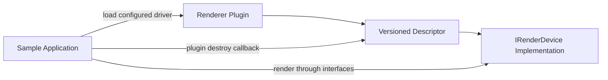

# Rendering Architecture

The rendering abstraction lives under `src/forg/include/forg/rendering/`.
Applications and engine code use the `IRenderDevice` family of interfaces;
backend implementations provide the platform-specific rendering behavior.

## Backends

- **Reference software renderer** is compiled into the `forg` library under
  `src/forg/include/forg/rendering/reference/`.
- **Software renderer plugin** under `src/swrenderer/` wraps the reference
  renderer with a platform presentation layer. It uses CoreGraphics and
  `CALayer` on macOS, GDI on Windows, and SDL on Linux.
- **Metal renderer plugin** under `src/metalrenderer/` hosts a `CAMetalLayer` in
  the sample application's `NSView`. It is the default macOS backend.
- **OpenGL renderer plugin** under `src/glrenderer/` is loaded at runtime on
  Windows.
- **OpenCL and C++ AMP renderers** are unsupported legacy sources and are not
  part of the canonical CMake build.

## Plugin Boundary

Sample applications select a renderer driver from `config.yml` and load its
shared library with `dlopen` or `LoadLibrary`. Canonical plugins expose a
versioned descriptor containing a display name and a plugin-local destroy
callback. The callback ensures hosts do not delete plugin-owned renderer
objects across a shared-library or CRT boundary.

The loaders retain compatibility with version-1 descriptors and legacy plugins
that export only `forgCreateRenderer`.

## Input And Presentation

`Engine` handles normalized events from `forg/Input.h`. Platform applications
translate native mouse and input events before calling `Engine::HandleInput`,
so camera and scene controls do not depend on the selected presentation layer
or renderer backend.

[Back to the architecture index](ARCHITECTURE.md)
